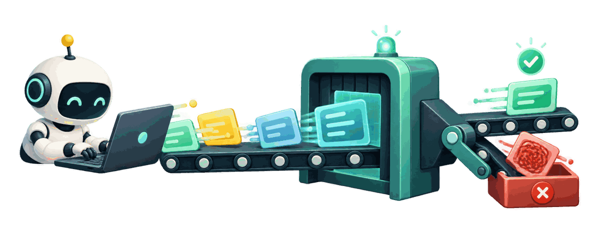
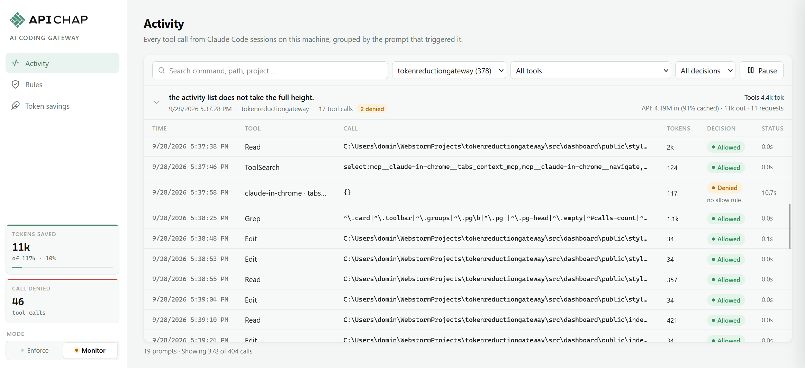
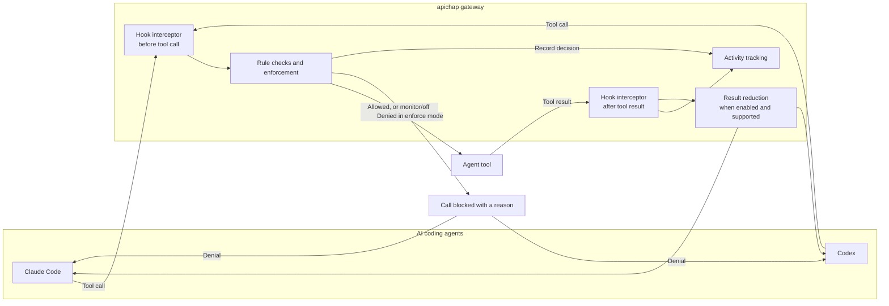

<h1 align="center">
  
  apichap AI Coding Gateway
</h1>

<p align="center">
  
</p>

<h3 align="center">Tracks every Tool Call. </h3>
<h3 align="center">Denies prohibited Tool Calls.</h3>
<h3 align="center">Reduces unused Context from Tool Calls.</h3>

<p align="center">
  <a href="https://www.npmjs.com/package/apichap-ai-coding-gateway"></a>
  
  
  <a href="LICENSE"></a>
  
  
</p>

## Install

Add a local gateway that checks Claude Code and Codex tool calls against your rules, blocks prohibited actions, and shortens supported tool output to save context.

### Claude Code

```bash
npx apichap-ai-coding-gateway init --agent claude
```

### Codex

```bash
npx apichap-ai-coding-gateway init --agent codex
```

## Open the Dashboard

Open the dashboard to see and manage your activities.

```bash
npx apichap-ai-coding-gateway dashboard
```

<p align="center">
  
  <br>
  <em>Code with Claude Code while watching Claude´s tool calls live and allow rules across your projects.</em>
</p>

---

## How it works

The gateway uses hooks in Claude Code and Codex to see tool calls before they run and results after they finish.
It checks each call against your rules, records what happened, and can shorten results before they return to the conversation. The agent's own permission checks still apply; the gateway adds restrictions.



In **monitor** mode, the gateway reports calls that rules would deny but lets them run. In **off** mode, it skips rule checks. **Enforce** blocks denied and unlisted calls.

## Supported agents

Install the integration you use. The gateway shares its rules, mode, dashboard, and local history across integrations.

### Claude Code

```bash
npx apichap-ai-coding-gateway init --agent claude
```

Claude Code hooks are added to `~/.claude/settings.json` (or `$CLAUDE_CONFIG_DIR/settings.json`). This integration supports permission checks and token reduction.

### Codex

```bash
npx apichap-ai-coding-gateway init --agent codex
```

Codex hooks are added to `$CODEX_HOME/hooks.json` (or `~/.codex/hooks.json`). Review and trust the hooks in Codex before they run. Permission checks and activity tracking are supported; token reduction is not currently available for Codex.

To remove an integration's hooks, pass the same agent name:

```bash
npx apichap-ai-coding-gateway uninstall --agent claude
```

`init` backs up the settings file, preserves other settings and hooks, and replaces earlier gateway hooks. You can run it again safely.

## Documentation

- [Dashboard](#dashboard)
- [Rules](#rules)
- [Modes](#modes)
- [Token reduction](#token-reduction)
- [Command line](#command-line)
- [Data and privacy](#data-and-privacy)
- [Limitations](#limitations)
- [Development](#development)
- [Teams and enterprise (roadmap)](#teams-and-enterprise-roadmap)
- [License](#license)

### Dashboard

Start the dashboard with:

```bash
npx apichap-ai-coding-gateway dashboard
```

The **Activity** page shows tool calls grouped by the prompt that started them. Open a call to see its details, result, and which rule decided it. The **Rules** page lets you change policies and rules. **Token savings** shows reduction options and the savings they have produced.

The dashboard runs on this computer at `127.0.0.1`. Use `--port <number>` to choose a port or `--no-open` to keep it from opening a browser tab.

### Rules

Rules say which tool calls are allowed or denied. They are organised into groups, each with a plain-language policy title such as **The agent is not allowed to delete files**. You can turn a group off, edit its rules, move a rule to another group, or create your own group.

The decision order is simple:

1. A matching **deny** rule blocks the call. Deny rules always win.
2. Otherwise, a matching **allow** rule lets it proceed to the agent's own permission checks.
3. If no allow rule matches, the call is denied as **unlisted**.

For example, `Shell(git *)` allows Git commands in Bash and PowerShell, while `Bash(git status)` matches only that Bash command. `FileRead({cwd}/**)` applies to reading and searching inside the current project. In patterns, `*` matches within one folder and `**` can cross folders. `{cwd}`, `{home}`, and `{tmp}` stand for the project, home, and temporary folders.

**When a call is denied:** open it on the Activity page and choose **Allow this call…**. For an unlisted call, the gateway suggests an exact rule and a broader rule; choose the narrowest one that fits. You can add it to the suggested group or choose another group. If a deny rule blocked the call, an allow rule cannot override it—edit or disable that deny rule instead.

You can also manage rules from the command line:

```bash
apichap-gateway rules                       # list rules and groups
apichap-gateway rules add allow "Shell(git status)" --note "Read-only status check"
apichap-gateway rules test "Bash(git status && git push --force)"
apichap-gateway rules disable 12            # disable rule 12
```

The dashboard's **Import…** and **Export** actions let you move rules between installations. Import shows a preview first: **Add** keeps existing rules and adds new ones; **Replace** removes the current rules before importing. CLI imports replace by default; add `--merge` to add missing rules instead. Use `rules reset` to restore the built-in rules (or `rules reset --merge` to add missing defaults without replacing yours).

### Modes

Choose the mode in the dashboard sidebar or run `apichap-gateway mode <mode>`:

| Mode                | What happens                                                                                             |
| ------------------- | -------------------------------------------------------------------------------------------------------- |
| `enforce` (default) | Blocks calls denied by a rule and calls no allow rule covers. If the gateway fails, the call is blocked. |
| `monitor`           | Checks and records calls, including ones that would be denied, but lets them run.                        |
| `off`               | Skips rule checks and records calls.                                                                     |

The selected mode is saved and remembered after a restart. `APICHAP_GATEWAY_MODE` overrides the saved setting when set.

### Token reduction

Token reduction shortens tool results before they reach the conversation. In Claude Code, turn individual options on or off from **Token savings** in the dashboard. The page describes each option and shows its savings. Codex currently supports tracking and rule enforcement; token reduction is not available for Codex yet.

Options include removing terminal color codes and repeated output, compacting JSON, condensing test and build logs, paging through long results, and limiting large reads or search results. Each option has its own default. A shortened result explains what was omitted and how to retrieve more; long results can be paged through with Read.

### Command line

Use `npx apichap-ai-coding-gateway` or the global `apichap-gateway` command. Include `--agent claude` or `--agent codex` when installing or removing hooks:

```bash
npx apichap-ai-coding-gateway init --agent claude
npx apichap-ai-coding-gateway init --agent codex
npx apichap-ai-coding-gateway uninstall --agent claude
npx apichap-ai-coding-gateway dashboard
npx apichap-ai-coding-gateway mode enforce
npx apichap-ai-coding-gateway rules
npx apichap-ai-coding-gateway reduction
```

Other useful commands include `rules add`, `rules enable` or `rules disable`, `rules import`, `rules export`, and `reduction set <id> on|off`. Run `npx apichap-ai-coding-gateway` without a command to see the full command list.

### Data and privacy

The gateway keeps its local history, settings, and rules in `~/.ai-coding-gateway/gateway.sqlite`. It also writes an error log and may keep full results for long calls that were shortened; those temporary results are removed after three days. Set `APICHAP_GATEWAY_DIR` to use a different folder. Nothing in this setup requires a hosted account.

### Limitations

The gateway is a guardrail, not a sandbox. It checks tool calls against your rules, but an agent may still perform a risky action through a command your rules allow—for example, running a script in the project. Use operating-system or container isolation when you need a stronger boundary.

### Development

```bash
npm install
npm test
npm run typecheck
npm run build
npx tsx src/main.ts dashboard
```

To run hooks from this checkout while developing:

```bash
npx tsx src/main.ts init --agent claude --local
# Or connect Codex:
npx tsx src/main.ts init --agent codex --local
```

The hooks use the source on the next tool call, so a rebuild is not needed. To return to the installed package, run `init --agent claude` or `init --agent codex` again. New agent sessions pick up hook changes. In an existing Claude Code session, confirm them with `/hooks`.

For the project layout and contribution guidelines, see [CONTRIBUTING.md](CONTRIBUTING.md).

### Teams and enterprise (roadmap)

This version stores rules and activity locally and is designed for individual developers. Shared team rules and a central audit log are planned.

### License

[GNU General Public License v3.0](LICENSE)
